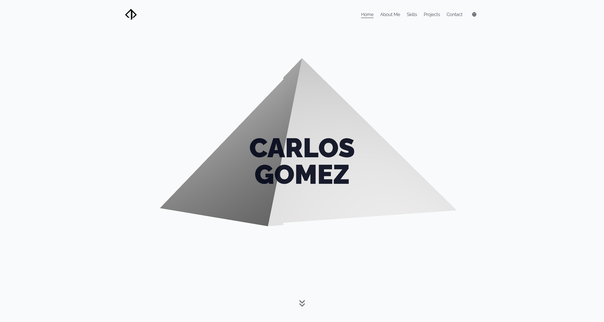

# Hominid Interactive Portfolio

This is my frontend developer portfolio built with [**SvelteKit**](https://svelte.dev/), **Threlte (Three.js)**, and **Motion**. The project serves as an exploration of the new Svelte 5 signal system, as well as SvelteKit’s server-side rendering optimizations such as **SSR** and **prerendering**. Threlte adds a clean, Svelte-friendly abstraction layer over Three.js, making it easier to work with 3D rendering and interactions in an idiomatic way.

- Smooth CSS animations powered by **[Motion](https://motion.dev/)**

- 3D rendering and lighting interactions using **[Threlte](https://threlte.xyz/)**

- Internationalization handled with **[Paraglide](https://inlang.com/m/gerre34r/library-inlang-paraglideJs)**

- Styling with **[Tailwind CSS](https://tailwindcss.com/)** and UI components from **[shadcn-svelte](https://www.shadcn-svelte.com/)**

- Fully typed with JSDoc TypeScript
